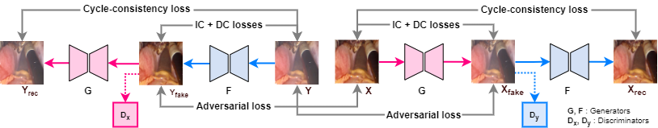

# Investigation of the ability to remove smoke and blood in 3D surgical images using unpaired and paired data

Authors: Omer Raza

## Losses
IC & DC loss implementations are adapted from this <a href="https://github.com/yiroup20/DeSmoke-LAP"> repo</a>

## Model Architecture

The model is built based on the architecture of <a href="https://github.com/junyanz/pytorch-CycleGAN-and-pix2pix">CycleGAN</a> network

## Prerequisites
- Linux or macOS
- Python 3
- CPU or NVIDIA GPU + CUDA CuDNN

### Model train/test
- You can follow the steps in our provided Colab Notebook , titled Simul3D, to train and test with your own data or use our pretrained models.

## Acknowledgments
Our code is inspired by [pytorch-CycleGAN-and-pix2pix](https://github.com/junyanz/pytorch-CycleGAN-and-pix2pix) and [DeSmoke-LAP](https://github.com/yiroup20/DeSmoke-LAP)
