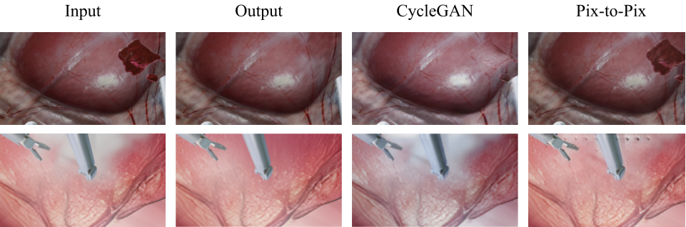

# Surgical Blender
This repository includes the reference code and dataset mentioned in the paper *Surgical Blender: A Synthetic Video Dataset Generator for Robot-Assisted Surgery*

Surgical Blender is an open-source surgical dataset generation framework that integrates with smoke, blood, and vessel vibration to generate realistic surgical videos with rich annotations. We demonstrate the effectiveness of Surgical Blender by developing 17 synthetic surgical videos and 7 semi-synthetic surgical videos for tasks ranging from segmentation tasks (surgical instrument segmentation and bleeding source segmentation) to image-to-image translation (smoke removal and blood removal). 


# Task 1: Segmentation
# Dataset
Fully-synthetic video dataset and Semi-Synthetic video dataset are available from [here](https://t.ly/HTCjj)

# Evaluation
## 1.Download pretrained model
To reproduce the results of DeepLabv3+ and LinkNet34 by using different datasets reported in our paper, first download the [pretrained models](https://t.ly/TBWR) 


## 2.Sim-to-Real instrument segmentation 
(All results are evaluated on the **Real Dataset**)

### 2.1. Using Real dataset </br>
*Deeplabv3+*
Run  `python test.py --model DeepLabv3_plus --type instruments --checkpoint /SurgicalBlender/Segmentation/runs/instrument_segmentation/real_dataset/DeepLabv3_plus/best_model.pt`

*LinkNet34*  </br>
Run  `python test.py --model LinkNet34 --type instruments --checkpoint /SurgicalBlender/Segmentation/runs/instrument_segmentation/real_dataset/LinkNet34/best_model.pt`

### 2.2. Using Semi-Part Dataset  
*Deeplabv3+* </br>
Run  `python test.py --model DeepLabv3_plus --type instruments --checkpoint /SurgicalBlender/Segmentation/runs/instrument_segmentation/semi_part_dataset/DeepLabv3_plus/best_model.pt`

*LinkNet34*  </br>
Run  `python test.py --model LinkNet34 --type instruments --checkpoint /SurgicalBlender/Segmentation/runs/instrument_segmentation/real_dataset/LinkNet34/best_model.pt`

### 2.3. Using Semi-full Dataset
*Deeplabv3+* </br>
Run  `python test.py --model DeepLabv3_plus --type instruments --checkpoint /SurgicalBlender/Segmentation/runs/instrument_segmentation/semi_full_dataset/DeepLabv3_plus/best_model.pt`

*LinkNet34*  </br>
Run  `python test.py --model LinkNet34 --type instruments --checkpoint /SurgicalBlender/Segmentation/runs/instrument_segmentation/semi_full_dataset/LinkNet34/best_model.pt`

### 2.3. Using Semi-full Dataset with 50 Real images
*Deeplabv3+* </br>
Run  `python test.py --model DeepLabv3_plus --type instruments --checkpoint /SurgicalBlender/Segmentation/runs/instrument_segmentation/semi_withReal_dataset/DeepLabv3_plus/best_model.pt`

*LinkNet34*  </br>
Run  `python test.py --model LinkNet34 --type instruments --checkpoint /SurgicalBlender/Segmentation/runs/instrument_segmentation/semi_withReal_dataset/LinkNet34/best_model.pt`

## 3.Sim-to-Real bleeding source segmentation

### Using Fully-Synthetic Dataset

3.1 Using Fully-Synthetic validation set

*Deeplabv3+* </br>
Run  `python test.py --model DeepLabv3_plus --type binary --dataset fully_synthetic --checkpoint /mnt/disk1_ssd/mengya/SurgicalBlender/Segmentation/runs_our_results/bleeding_source_segmentation/DeepLabv3_plus/best_model.pt`

*LinkNet34*  </br>
Run  `python test.py --model LinkNet34 --type binary --dataset fully_synthetic --checkpoint /mnt/disk1_ssd/mengya/SurgicalBlender/Segmentation/runs_our_results/bleeding_source_segmentation/LinkNet34/best_model.pt`

3.2 Change the validation set with Real Dataset

*Deeplabv3+* </br>
Run  `python test.py --model DeepLabv3_plus --type binary --checkpoint /mnt/disk1_ssd/mengya/SurgicalBlender/Segmentation/runs_our_results/bleeding_source_segmentation/DeepLabv3_plus/best_model.pt --change_test_set True`

*LinkNet34*  </br>
Run  `python test.py --model LinkNet34 --type binary --checkpoint /mnt/disk1_ssd/mengya/SurgicalBlender/Segmentation/runs_our_results/bleeding_source_segmentation/LinkNet34/best_model.pt --change_test_set True`

|Dataset|DeepLabv3_plus|LinkNet34|
|:---:|:---:|:-----:|
|Real|37.77|30.33|
|Semi_Part|16.51|20.73|
|Semi_Full|18.84|22.30 |
|Semi_Full+50 Real images|33.86|29.43
<br>


# Training

## 1. Sim-to-Real instrument segmentation

### 1.1. Using Real dataset </br>
*Deeplabv3+*
Run  `python train.py --model DeepLabv3_plus --type instruments --root runs_test/real_dataset/DeepLabv3_plus --dataset real`

*LinkNet34*  </br>
Run  `python train.py --model LinkNet34 --type instruments --root runs/real_dataset/LinkNet34 --dataset real`

### 1.2. Using Semi-Part dataset </br>
*Deeplabv3+*
Run  `python train.py --model DeepLabv3_plus --type instruments --root runs/semi_part_dataset/DeepLabv3_plus --dataset semi_part`

*LinkNet34*  </br>
Run  `python train.py --model LinkNet34 --type instruments --root runs/semi_part_dataset/LinkNet34 --dataset semi_part`

### 1.3. Using Semi-Full dataset </br>
*Deeplabv3+*
Run  `python train.py --model DeepLabv3_plus --type instruments --root runs/semi_full_dataset/DeepLabv3_plus --dataset semi_full`

*LinkNet34*  </br>
Run  `python train.py --model LinkNet34 --type instruments --root runs/semi_full_dataset/LinkNet34 --dataset semi_full`

### 1.4. Using Semi-full Dataset with 50 Real images
*Deeplabv3+*
Run  `python train.py --model DeepLabv3_plus --type instruments --root runs/semi_withReal_dataset/DeepLabv3_plus --dataset semi_full --add_real True`

*LinkNet34*  </br>
Run  `python train.py --model LinkNet34 --type instruments --root runs/semi_withReal_dataset/LinkNet34 --dataset semi_full --add_real True`

## 2. Sim-to-Real bleeding source segmentation
*Deeplabv3+* </br>
Run `python train.py --model DeepLabv3_plus --type instruments --root runs/binary/DeepLabv3_plus --dataset fully_synthetic`

*LinkNet34*  </br>
Run `python train.py --model LinkNet34 --type instruments --root runs/binary/LinkNet34 --dataset fully_synthetic`

## Acknowledgments
Our code is inspired by [MICCAI 2017 Robotic Instrument Segmentation](https://github.com/ternaus/robot-surgery-segmentation).

# Task 2: Image-to-Image Translation (De-Blood and De-Smoke)

# Investigation of the ability to remove smoke and blood in 3D surgical images using unpaired and paired data



## Model train/test
### Install
```pip install -r requirements.txt```
### Datasets

Use our <a href="https://gocuhk-my.sharepoint.com/:f:/g/personal/muhammadomerraza_cuhk_edu_hk/EqJ_9PsR4R5EsiUc9W8JKwYBuk8Z-wtSYb2xGq3y4n5wWw">dataset</a> (kinldy request the password from us) or your own dataset by creating the appropriate folders and adding in the images.
- Create a dataset folder under `/dataset` for your dataset.
- Create subfolders `testA`, `testB`, `trainA`, and `trainB` under your dataset's folder. For example, place clear images in the `trainA` folder, hazy images in the `trainB` folder, and do the same for the `testA` and `testB` folders.

### Pretrained models

Add the provided model under `/pretrained/[NAME]` to `./checkpoints/[NAME]/latest_net_G.pt` (Pretrained models can be found [here](https://drive.google.com/drive/folders/1BScWxXajVd1JmN6TxylAscsOfZN8pgtM?usp=sharing).)

Or add your own pretrained model to `./checkpoints/{NAME}/latest_net_G.pt`

### Training


Change the `--dataroot` and `--name` to your own dataset's path and model's name. Use `--gpu_ids 0,1,..` to train on multiple GPUs and `--batch_size` to change the batch size. I've found that a batch size of 16 with total images of around 6.5k fits onto 2 RTX 3090 and can finish training an epoch in ~300s.

Once your model has trained, copy over the last checkpoint to a format that the testing model can automatically detect

<!-- Use `cp ./checkpoints/deblood_iter1/latest_net_G_A.pth ./checkpoints/deblood_iter1/latest_net_G.pth` if you want to transform images from class A to class B and `cp ./checkpoints/deblood_iter1/latest_net_G_B.pth ./checkpoints/deblood_iter1/latest_net_G.pth` if you want to transform images from class B to class A. -->

Below are different commands with the configs as used in our training & testing:
- ```python train.py --dataroot /mnt/disk2_hdd/User/"DeSmoke-LAP dataset"/Simul_3D --n_epochs 75 --n_epochs_decay 50 --name deblood_iter1 --model cycle_gan --batch_size 16 --display_id -1 --gpu_ids 0,1 --preprocess scale_width_and_crop```
- ```!python train.py --dataroot /mnt/disk2_hdd/User/"DeSmoke-LAP dataset"/Simul_3D/pix --n_epochs 75 --n_epochs_decay 50 --name deblood_iter3_paired --model template --batch_size 128 --display_id -1 --gpu_ids 0,1 --continue_train --epoch_count 35 --dataset_mode template```

### Testing

Change the `--dataroot` and `--name` to be consistent with your trained model's configuration.

- ```python test.py --dataroot /mnt/disk2_hdd/User/"DeSmoke-LAP dataset"/Simul_3D/testA --name deblood_iter1 --model test --no_dropout --eval --num_test 1000```
- ``` python test.py --dataroot /mnt/disk2_hdd/User/"DeSmoke-LAP dataset"/Simul_3D/pix --name deblood_iter3_paired_epoch115 --dataset_mode template --model template --no_dropout --eval --num_test 1000```

> from https://github.com/junyanz/pytorch-CycleGAN-and-pix2pix:
> The option --model test is used for generating results of CycleGAN only for one side. This option will automatically set --dataset_mode single, which only loads the images from one set. On the contrary, using --model cycle_gan requires loading and generating results in both directions, which is sometimes unnecessary. The results will be saved at ./results/. Use --results_dir {directory_path_to_save_result} to specify the results directory.

> For your own experiments, you might want to specify --netG, --norm, --no_dropout to match the generator architecture of the trained model.


## Model Architecture & Losses

The model is built based on the architecture of <a href="https://github.com/junyanz/pytorch-CycleGAN-and-pix2pix">CycleGAN</a> network. IC(Inter Channel) & DC(Dark Channel) loss implementations are adapted from this <a href="https://github.com/yiroup20/DeSmoke-LAP"> repo</a>


## Acknowledgments
Our code is inspired by [pytorch-CycleGAN-and-pix2pix](https://github.com/junyanz/pytorch-CycleGAN-and-pix2pix) and [DeSmoke-LAP](https://github.com/yiroup20/DeSmoke-LAP)

