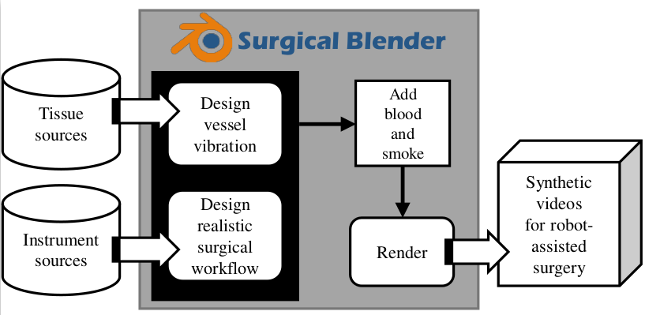

# Surgical Blender
This repository includes the reference code and dataset mentioned in the paper *Surgical Blender: A Synthetic Video Dataset Generator for Robot-Assisted Surgery*

Surgical Blender is an open-source surgical dataset generation framework that integrates with smoke, blood, and vessel vibration to generate realistic surgical videos with rich annotations. We demonstrate the effectiveness of Surgical Blender by developing 17 synthetic surgical videos and 7 semi-synthetic surgical videos for tasks ranging from segmentation tasks (surgical instrument segmentation and bleeding source segmentation) to image-to-image translation (smoke removal and blood removal). 

# Dataset
Fully-synthetic video dataset and Semi-Synthetic video dataset are available from [here](https://t.ly/HTCjj)

# Evaluation
## 1.Download pretrained model
To reproduce the results of DeepLabv3+ and LinkNet34 by using different datasets reported in our paper, first download the [pretrained models](https://t.ly/TBWR) 

## 2.Sim-to-Real instrument segmentation 
(All results are evaluated on the **Real Dataset**)

### 2.1. Using Real dataset  
*Deeplabv3+*
Run  `python test.py --model DeepLabv3_plus --type instruments --checkpoint /SurgicalBlender/Segmentation/runs/instrument_segmentation/real_dataset/DeepLabv3_plus/best_model.pt`

*LinkNet34*   
Run  `python test.py --model LinkNet34 --type instruments --checkpoint /SurgicalBlender/Segmentation/runs/instrument_segmentation/real_dataset/LinkNet34/best_model.pt`

### 2.2. Using Semi-Part Dataset  
*Deeplabv3+*  
Run  `python test.py --model DeepLabv3_plus --type instruments --checkpoint /SurgicalBlender/Segmentation/runs/instrument_segmentation/semi_part_dataset/DeepLabv3_plus/best_model.pt`

*LinkNet34*   
Run  `python test.py --model LinkNet34 --type instruments --checkpoint /SurgicalBlender/Segmentation/runs/instrument_segmentation/real_dataset/LinkNet34/best_model.pt`

### 2.3. Using Semi-full Dataset
*Deeplabv3+*  
Run  `python test.py --model DeepLabv3_plus --type instruments --checkpoint /SurgicalBlender/Segmentation/runs/instrument_segmentation/semi_full_dataset/DeepLabv3_plus/best_model.pt`

*LinkNet34*   
Run  `python test.py --model LinkNet34 --type instruments --checkpoint /SurgicalBlender/Segmentation/runs/instrument_segmentation/semi_full_dataset/LinkNet34/best_model.pt`

### 2.3. Using Semi-full Dataset with 50 Real images
*Deeplabv3+*  
Run  `python test.py --model DeepLabv3_plus --type instruments --checkpoint /SurgicalBlender/Segmentation/runs/instrument_segmentation/semi_withReal_dataset/DeepLabv3_plus/best_model.pt`

*LinkNet34*   
Run  `python test.py --model LinkNet34 --type instruments --checkpoint /SurgicalBlender/Segmentation/runs/instrument_segmentation/semi_withReal_dataset/LinkNet34/best_model.pt`

## 3.Sim-to-Real bleeding source segmentation

### Using Fully-Synthetic Dataset

3.1 Using Fully-Synthetic validation set

*Deeplabv3+*  
Run  `python test.py --model DeepLabv3_plus --type binary --dataset fully_synthetic --checkpoint /mnt/disk1_ssd/mengya/SurgicalBlender/Segmentation/runs_our_results/bleeding_source_segmentation/DeepLabv3_plus/best_model.pt`

*LinkNet34*   
Run  `python test.py --model LinkNet34 --type binary --dataset fully_synthetic --checkpoint /mnt/disk1_ssd/mengya/SurgicalBlender/Segmentation/runs_our_results/bleeding_source_segmentation/LinkNet34/best_model.pt`

3.2 Change the validation set with Real Dataset

*Deeplabv3+*  
Run  `python test.py --model DeepLabv3_plus --type binary --checkpoint /mnt/disk1_ssd/mengya/SurgicalBlender/Segmentation/runs_our_results/bleeding_source_segmentation/DeepLabv3_plus/best_model.pt --change_test_set True`

*LinkNet34*   
Run  `python test.py --model LinkNet34 --type binary --checkpoint /mnt/disk1_ssd/mengya/SurgicalBlender/Segmentation/runs_our_results/bleeding_source_segmentation/LinkNet34/best_model.pt --change_test_set True`

|Dataset|DeepLabv3_plus|LinkNet34|
|:---:|:---:|:-----:|
|Real|37.77|30.33|
|Semi_Part|16.51|20.73|
|Semi_Full|18.84|22.30 |
|Semi_Full+50 Real images|33.86|29.43
 

# Training

## 1. Sim-to-Real instrument segmentation

### 1.1. Using Real dataset  
*Deeplabv3+*
Run  `python train.py --model DeepLabv3_plus --type instruments --root runs_test/real_dataset/DeepLabv3_plus --dataset real`

*LinkNet34*   
Run  `python train.py --model LinkNet34 --type instruments --root runs/real_dataset/LinkNet34 --dataset real`

### 1.2. Using Semi-Part dataset  
*Deeplabv3+*
Run  `python train.py --model DeepLabv3_plus --type instruments --root runs/semi_part_dataset/DeepLabv3_plus --dataset semi_part`

*LinkNet34*   
Run  `python train.py --model LinkNet34 --type instruments --root runs/semi_part_dataset/LinkNet34 --dataset semi_part`

### 1.3. Using Semi-Full dataset  
*Deeplabv3+*
Run  `python train.py --model DeepLabv3_plus --type instruments --root runs/semi_full_dataset/DeepLabv3_plus --dataset semi_full`

*LinkNet34*   
Run  `python train.py --model LinkNet34 --type instruments --root runs/semi_full_dataset/LinkNet34 --dataset semi_full`

### 1.4. Using Semi-full Dataset with 50 Real images
*Deeplabv3+*
Run  `python train.py --model DeepLabv3_plus --type instruments --root runs/semi_withReal_dataset/DeepLabv3_plus --dataset semi_full --add_real True`

*LinkNet34*   
Run  `python train.py --model LinkNet34 --type instruments --root runs/semi_withReal_dataset/LinkNet34 --dataset semi_full --add_real True`

## 2. Sim-to-Real bleeding source segmentation
*Deeplabv3+*  
Run `python train.py --model DeepLabv3_plus --type instruments --root runs/binary/DeepLabv3_plus --dataset fully_synthetic`

*LinkNet34*   
Run `python train.py --model LinkNet34 --type instruments --root runs/binary/LinkNet34 --dataset fully_synthetic`

## Acknowledgments
Our code is inspired by [MICCAI 2017 Robotic Instrument Segmentation](https://github.com/ternaus/robot-surgery-segmentation).

